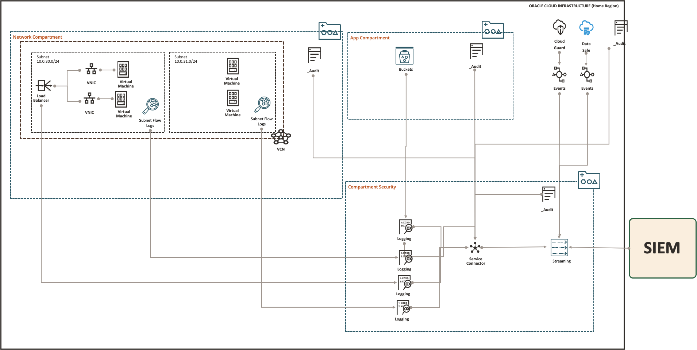

# SIEM Integration Example

This example manages the infrastructure resources for integrating OCI logs and events to an external SIEM (Security Information and Event Management) service. 
It does so using [Events](https://github.com/oracle-quickstart/terraform-oci-cis-landing-zone-observability/blob/main/events), [Streams](https://github.com/oracle-quickstart/terraform-oci-cis-landing-zone-observability/blob/main/streams) and [Service Connectors](https://github.com/oracle-quickstart/terraform-oci-cis-landing-zone-observability/service-connectors/blob/main/service-connectors) modules in the CIS OCI Foundations Benchmark Modules Collection.

The module creates the following resources:
- Cloud Guard event rules in the tenancy root compartment.
- Data Safe event rules in the tenancy root compartment.
- One Stream Pool in the in the compartment specified by *stream_compartment_ocid* variable.
- One Stream in the in the compartment specified by *stream_compartment_ocid* variable.
- One Service Connector in the compartment specified by *service_connector_compartment_ocid*. The Service Connector collects data from all audit logs in the tenancy and from non audit logs (including flow logs, bucket logs, custom logs) from the compartments specified by *logs_compartment_ocids* variable.
- One IAM policy allowing the Service Connector Hub service to push collected data to the Stream.

The pattern is illustrated in the diagram below:



## Using this example
1. Rename *input.auto.tfvars.template* to *\<project-name\>.auto.tfvars*, where *\<project-name\>* is any name of your choice.

2. Within *\<project-name\>.auto.tfvars*, provide tenancy connectivity information and adjust the required variables, by making the appropriate substitutions:
   - Replace *\<REPLACE-BY-COMPARTMENT-OCID\>* placeholders by appropriate compartment OCIDs. 

3. In this folder, run the typical Terraform workflow:
```
terraform init
terraform plan -out plan.out
terraform apply plan.out
```
