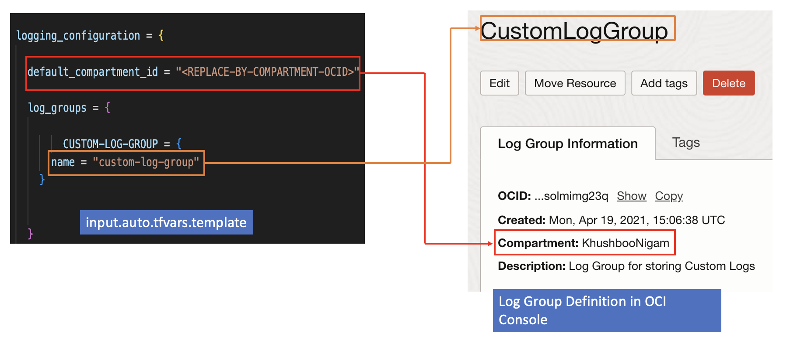

# CIS OCI Logging Module Example - Custom Logs

## Introduction

This example shows how to deploy custom logs for a linux compute instance in OCI using the *logging_configuration* attribute.

The picture below shows side by side how the various attributes in *logging_configuration* variable within *input.auto.tfvars.template* map to the log group and logs definition in OCI (as shown in OCI Console). 


(./images/attributes-to-oci-mapping-2.png)

## Using this example
1. Rename *input.auto.tfvars.template* to *\<project-name\>.auto.tfvars*, where *\<project-name\>* is any name of your choice.

2. Within *\<project-name\>.auto.tfvars*, provide tenancy connectivity information and adjust the *logging_configuration* input variable, by making the appropriate substitutions:
   - Replace *\<REPLACE-BY-COMPARTMENT-OCID\>*, *\<REPLACE-BY-DYNAMIC-GROUP-OCID\>*, *\<REPLACE-BY-PATHS-FROM-INSTANCE\>* placeholders by appropriate compartment, Dynamic Group OCIDs and path for log directory from instance.

Refer to [Logging' module README.md](../../README.md) for overall attributes usage.

3. In this folder, run the typical Terraform workflow:
```
terraform init
terraform plan -out plan.out
terraform apply plan.out
```